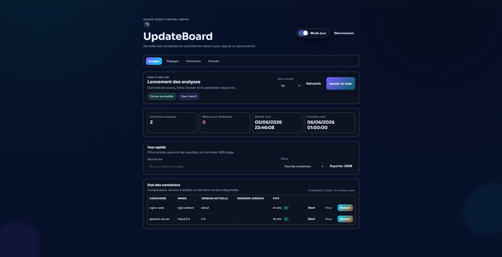
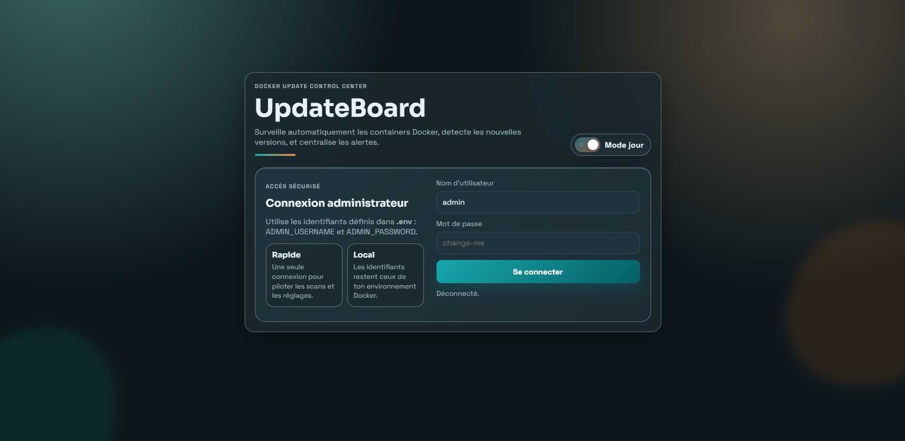

# Not ready !

# UpdateBoard

Modern web panel allowing to automatically analyze Docker containers, detect available updates and centralize all notifications related to their status.

## Pictures

### Dashboard



---

### Login page



## Language

...

## Functionalities

- Automatic scan of all Docker containers in execution
- Comparison of the installed version with the latest version available
- Configurable daily planning (by default: 01:00)
- Manual scan via panel
- Multi-channel notifications:
- Discord (webhook)
- Telegram (bot + chat ID)
- Email (SMTP)
- HTTP Webhook
- Modern, clear and responsive web interface
- Persistence of adjustment and state in `data/`


## Download

``` docker pull ghcr.io/docker-update/updateboard:latest ```

## How update detection works

- The service reads the image of each container in execution.
- He's questioning the registry to retrieve the tag list.
- If semver tags are available, the highest version is considered "last version".
- Otherwise, the system tries a fallback on the tag `latest`.

## Notes importantes

- This project and currently in the creation phase and therefore not finished
